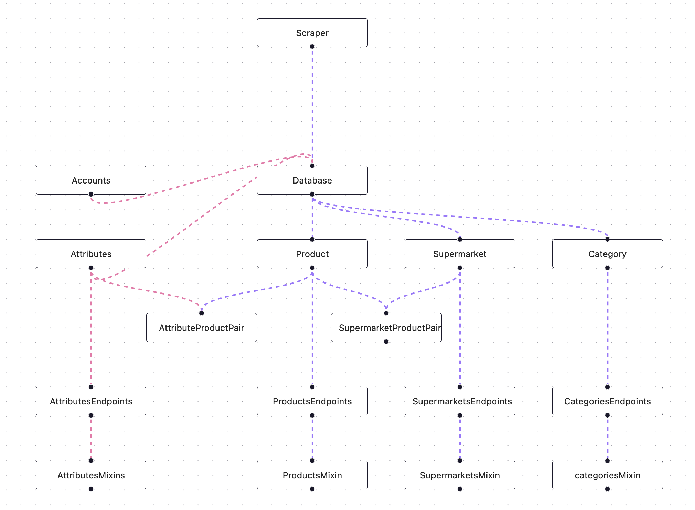

<div align="center"></div>

# San workflow
San workflow is created using React Flow, a library for building node-based applications.
The aim of the workflow is to show the diagram on how the data is being process within the application.

## Getting started
```bash
npm install 

npm run dev
```

## What is San
San is an app that helps people find the shopping items and best places to eat based on their dietary restrictions. It's created to help people with celiac disease, gluten intolerance, and other dietary restrictions.

San is made with two microservices; Aurora-Nexus the front-end and Underground-City the back-end.

Links:
- [San](https://github.com/Silvinecoder/San)